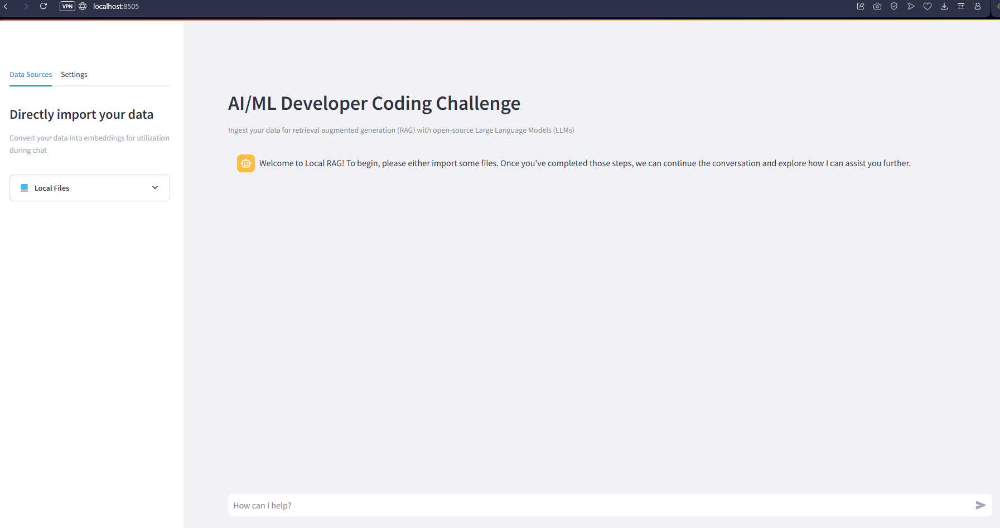
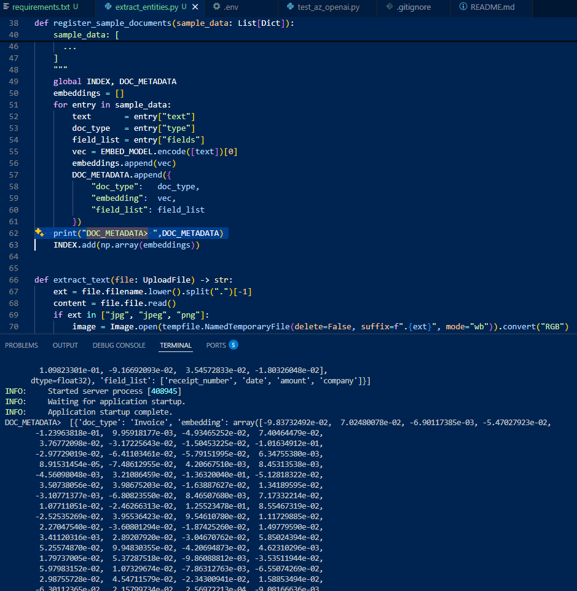
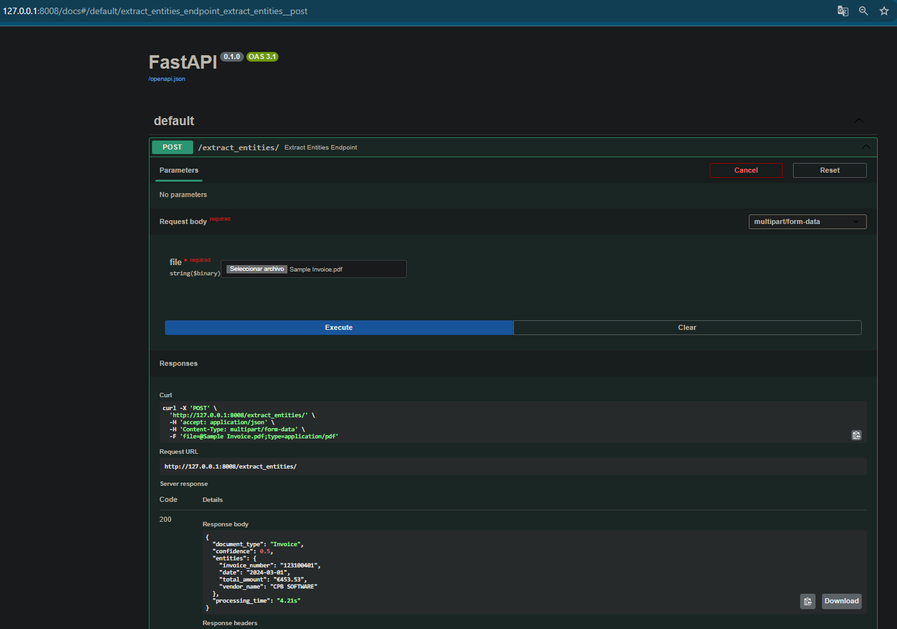

# RAG API

LOCAL RAG ENVIRONMENT

## Prerequisites

Before starting with Local RAG, make sure you have the following installed:
- Install in your system:
```bash
sudo apt-get install poppler-utils
sudo apt install tesseract-ocr
```

- A running [Ollama](https://github.com/ollama/ollama/) instance on your local machine
- At least one model loaded in Ollama  
    - Suggested models: `gemma3:2b` or `gemma3:latest`
- Python installed

**NOTE:** This setup is *not tested* on Windows Subsystem for Linux. For optimal compatibility, consider running on a native Linux environment.

### Running Locally
```bash
pip install pipenv && pipenv install
pipenv install -r requirements.txt
pipenv shell
streamlit run main.py
```

### Ollama Settings

| Setting           | What it does                                                            | Default                   |
|-------------------|-------------------------------------------------------------------------|---------------------------|
| **Ollama Endpoint** | The URL where your local Ollama API is running                        | http://localhost:11434    |
| **Model**         | The language model used to generate responses                          | *(you choose)*            |
| **Top K**         | Number of similar documents to fetch when answering a question         | 3                         |
| **Chat Mode**     | The Llama Index mode used for retrieving and generating responses      | Best                      |

###  Embeddings Settings

| Setting             | What it does                                                           | Default             |
|---------------------|------------------------------------------------------------------------|---------------------|
| **Embedding Model** | The model used to convert your documents into vectors                  | bge-large-en-v1.5   |
| **Chunk Size**      | Breaks text into smaller parts to improve embedding accuracy           | 1024                |


### Edit Prompt
Is possible adapt the prompt in components\page_state.py file. Into the "system_prompt" variable.

## Example of Execution FAST API EXTRACT ENTITIES
#### Command to execute the API endpoint extract_entities
python utils/extract_entities.py
#### Example of execution and vector embedding

#### Example of result for an document 



---

---

### UNIT TESTS & CI/CD PIPELINE

LOCAL UNIT TESTING & GITHUB ACTIONS CI


> *The image above shows the GitHub repository settings where you configure Secrets under "Actions → Variables." These are essential for securely storing sensitive credentials such as API keys, avoiding hardcoding them directly into the source code or CI pipeline.*

---

## 1. Unit Testing

This project includes a unit test located in **`utils/unittest.py`** that validates the entire extraction pipeline:

- Reads from a sample invoice file (**`utils/invoice_test.txt`**)
- Uses the function `verify_extracted_entities()` defined within the test
- Internally imports `extract_entities.py` for invoking the actual extraction logic
- Simulates and asserts the expected JSON output

###  How to run tests locally:
```bash
python utils/unittest.py
